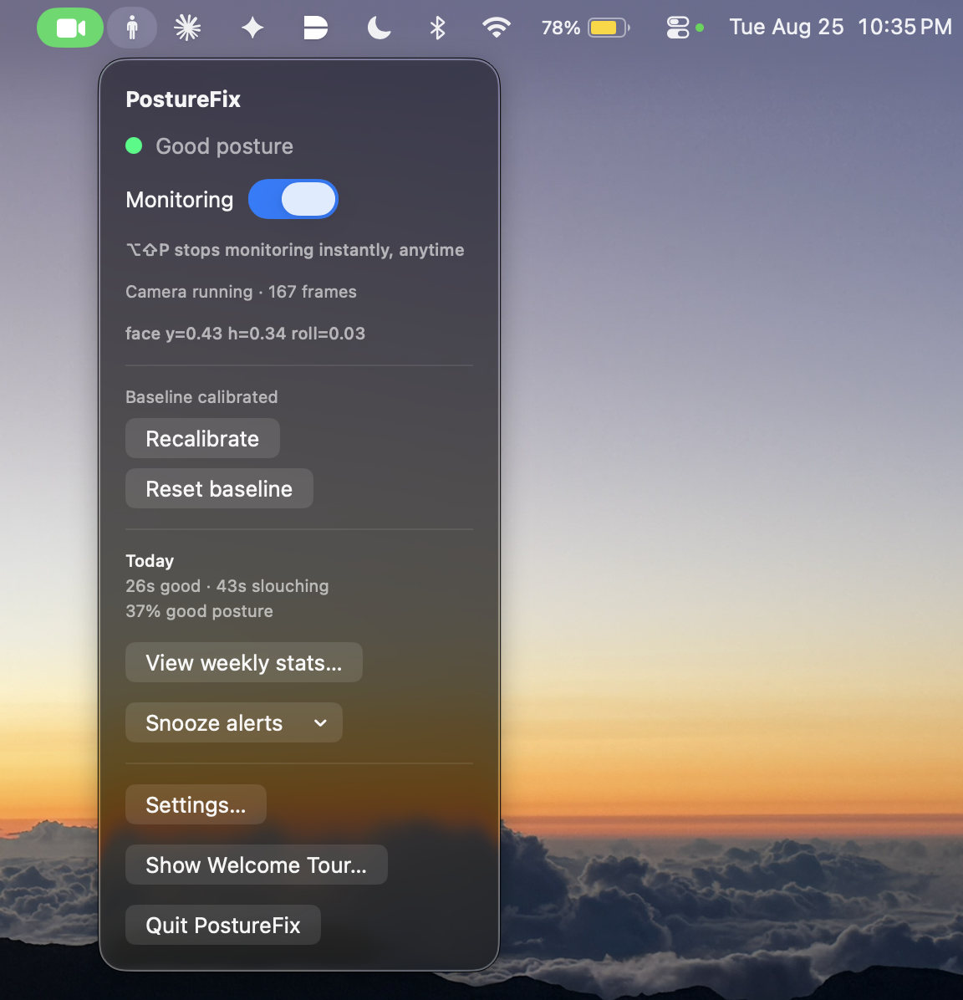
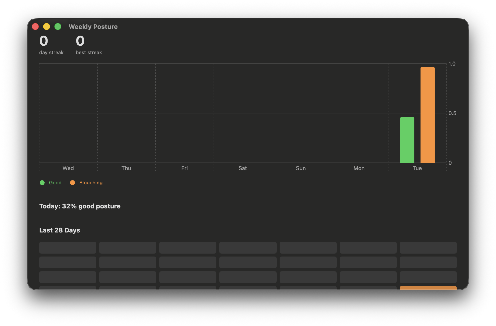

# PostureFix

PostureFix is a macOS menu bar app that watches your posture through your webcam and gently nudges you when you slouch. It runs quietly in the background, learns what *your* good posture looks like, and tracks your progress over time — all processed locally on your Mac.

<!-- SCREENSHOT: Menu bar icon + popover showing live posture status -->


<!-- SCREENSHOT: Weekly stats dashboard with the bar chart and streak grid -->


<!-- SCREENSHOT: Onboarding calibration step -->


## Features

- **Live posture detection** — uses Apple's Vision framework to track head position, height, and tilt from your webcam feed
- **Personal calibration** — a short "sit normally" capture defines your own baseline, so alerts are tuned to you, not a generic pose
- **Smart alerts** — only fires after a sustained slouch (not a single bad frame), with a cooldown so it doesn't spam you, and a snooze option
- **Stats & streaks** — daily good/bad posture time, a 7-day trend chart, and a 28-day streak calendar
- **Menu bar native** — no Dock icon, lives entirely in the menu bar
- **Emergency hotkey** — `⌥⇧P` instantly stops monitoring and turns off the camera from anywhere, even if the menu bar icon isn't visible
- **Configurable** — sensitivity, alert frequency, and launch-at-login, all in a native Settings window

## Project structure

```
PostureFix/
├── project.yml                      # XcodeGen spec — source of truth for the Xcode project
├── Package.swift                    # SwiftPM manifest (kept for CLI builds/tests)
├── PostureFix.xcodeproj/            # Generated by `xcodegen generate` — do not edit by hand
│
└── Sources/PostureFix/
    ├── PostureFixApp.swift          # App entry point, menu bar + window scenes
    ├── AppState.swift               # Central app state: posture logic, alerts, stats, settings glue
    │
    ├── CameraManager.swift          # AVFoundation capture session, camera permissions
    ├── PostureDetector.swift        # Vision-based face/posture sampling per frame
    ├── PostureCalibration.swift     # Baseline model, slouch thresholds, classification
    │
    ├── SessionStats.swift           # Daily good/bad posture time tracking + persistence
    ├── Streaks.swift                # Streak qualification and calculation
    │
    ├── Settings.swift               # Persisted user settings model
    ├── NotificationManager.swift    # macOS notification alerts
    ├── LaunchAtLogin.swift          # SMAppService login-item integration
    ├── EmergencyHotkey.swift        # Global ⌥⇧P hotkey (Carbon Hot Key Manager)
    ├── SystemSettings.swift         # Deep link into System Settings' camera privacy pane
    │
    ├── MenuBarContentView.swift     # Menu bar popover UI
    ├── StatsDashboardView.swift     # Weekly stats + streak calendar window
    ├── SettingsView.swift           # Settings window
    ├── OnboardingView.swift         # First-run walkthrough
    │
    └── Resources/
        ├── Info.plist               # Camera usage description, menu-bar-only flag, etc.
        ├── PostureFix.entitlements  # App sandbox / camera entitlements
        └── Assets.xcassets/         # App icon
```

## Built with

| Area | Technology |
|---|---|
| UI | SwiftUI (`MenuBarExtra`, `Window` scenes, Swift Charts) |
| Camera capture | AVFoundation (`AVCaptureSession`) |
| Posture detection | Vision (`VNDetectFaceRectanglesRequest`) |
| Notifications | UserNotifications |
| Login item | ServiceManagement (`SMAppService`) |
| Global hotkey | Carbon Hot Key Manager (`HIToolbox`) |
| Persistence | `UserDefaults` (JSON-encoded models) |
| Project generation | [XcodeGen](https://github.com/yonaskolb/XcodeGen) |

No third-party dependencies and no network calls — everything runs on-device.

## Requirements

- macOS 13.0 or later
- Xcode 15 or later
- A Mac with a webcam

## Installation

1. **Install [XcodeGen](https://github.com/yonaskolb/XcodeGen)** (used to generate the Xcode project from `project.yml`):
   ```bash
   brew install xcodegen
   ```

2. **Clone the repo and generate the project:**
   ```bash
   git clone <your-repo-url> PostureFix
   cd PostureFix
   xcodegen generate
   ```

3. **Open in Xcode and run:**
   ```bash
   open PostureFix.xcodeproj
   ```
   Press `Cmd+R`. Xcode will prompt you to select a signing team on first run — any free personal team works for local use.

## Usage

1. On first launch, PostureFix opens a short onboarding flow — grant camera access when prompted.
2. Sit the way you normally would with good posture, then run **Calibrate good posture** to set your baseline.
3. Toggle **Monitoring** on from the menu bar icon. PostureFix will alert you if you slouch for a sustained period.
4. Click the menu bar icon anytime to check today's stats, view the weekly dashboard, snooze alerts, or adjust settings.
5. Press **⌥⇧P** at any time to instantly stop monitoring and release the camera.

### Making changes to the project

Since the `.xcodeproj` is generated, don't edit it directly — change `project.yml` or the source files, then re-run:

```bash
xcodegen generate
```

## Roadmap

See [ROADMAP.md](ROADMAP.md) for the phased build plan this project followed.
